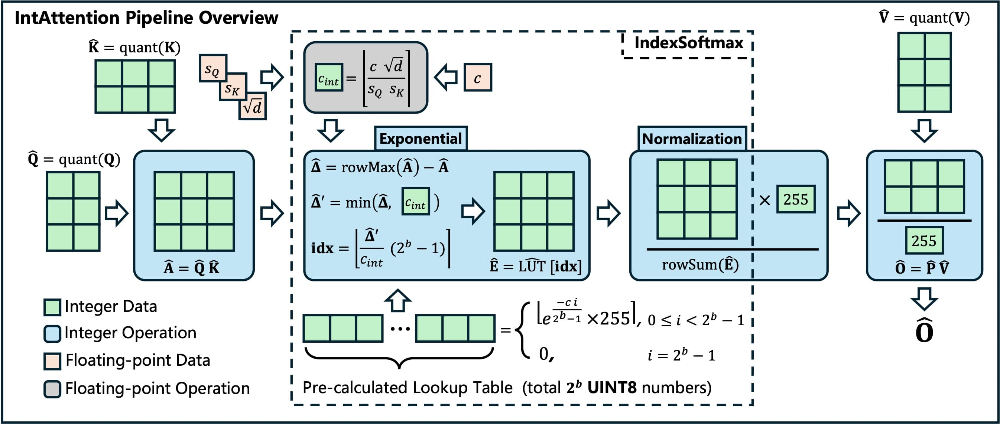

# IntAttention: A Fully Integer Attention Pipeline for Efficient Edge Inference
[[Paper Link](https://arxiv.org/abs/2511.21513)]
This repository contains the official code for the paper **"IntAttention: A Fully Integer Attention Pipeline for Efficient Edge Inference"** (MLSys 2026). It provides the complete pipeline to reproduce the speedup and accuracy results reported in the paper.



## Supported Claims

This repository provides the code to validate the two core claims of our paper:

1. **Claim 1 (Accuracy):** Our fully integer pipeline (IntAttention) maintains high-fidelity with FP16/Baseline accuracy across various LLMs and Vision Transformers. *(Corresponds to Table 1 and Table 2 in the paper).*
2. **Claim 2 (Latency/Speed):** The proposed IntAttention pipeline achieves significant latency reduction on ARM CPUs compared to FP32, FP16, and INT8 quantization baselines. *(Corresponds to Figure 6 and Figure 7 in the paper).*


## Repository Structure

* `pysimulation/`: PyTorch-based **simulation** of IntAttention and other baseline methods.
* `*.patch`: Patch to insert the IndexSoftmax implementation into the ARM ComputeLibrary and deit codebase.
* `acc_llm.py`: Evaluation script for Large Language Models.
* `bench_speed.cpp`: C++ benchmarking script for evaluating latency on Armv8 CPUs.


## Requirements

Due to the fundamental differences in hardware execution, our evaluation is split into two environments:

### 1. Latency / Speed Evaluation

* **Hardware:** Armv8.6-a architecture device. The build script is optimized for generalized embedding chips, especially Apple M-series chips (e.g., M2/M3/M4).
* **Software:** `scons`, `clang`.

### 2. Accuracy Evaluation

* **Hardware:** CUDA-compatible GPU with at least 10GB VRAM. *(Note: Because native INT32 matrix multiplication on GPUs is limited, our PyTorch simulation uses FP64 to guarantee precise INT32 emulation for accuracy validation).*
* **Software:** Python 3.10+, `pip`.


## 🚀 Part 1: Latency Evaluation (ARM CPU)

### 1. Setup and Build ComputeLibrary

Clone the repository and its submodules (ARM ComputeLibrary and DeiT):

```bash
git clone --recursive https://github.com/WanliZhong/IntAttention
cd IntAttention
```

Checkout the required version of ComputeLibrary and apply the IndexSoftmax patch:

```bash
cd ComputeLibrary
git checkout v52.5.0
git apply ../add_impl_for_llm.patch
```

Compile the ComputeLibrary:

```bash
scons -j"$(sysctl -n hw.ncpu)" \
  os=macos arch=armv8.6-a \
  neon=1 opencl=0 embed_kernels=0 logging=0 \
  Werror=0 debug=0 asserts=0 examples=0 \
  extra_cxx_flags="-mcpu=apple-m2"
```

### 2. Compile and Run Benchmark

Compile the C++ benchmark script:

```bash
cd ..
INCDIR="./ComputeLibrary"
LIBDIR="./ComputeLibrary/build"

clang++ bench_speed.cpp -O3 -std=c++17 -arch arm64 \
  -I "$INCDIR/include" -I "$INCDIR" \
  "$LIBDIR/libarm_compute-static.a" \
  "$LIBDIR/libarm_compute_graph-static.a" \
  -o bench_speed -lpthread -ldl
```

Run the speed tests. The benchmark supports 4 pipelines (`--pipe 0` to `3`):

* `0` (Pure FP32): QK(FP32) -> Softmax(FP32) -> PV(FP32)
* `1` (FP16): QK(F16) -> Cast(F32) -> Softmax(F32) -> Cast(F16) -> PV(F16)
* `2` (Quantized INT8): S8 QK -> S32 -> FP32 Softmax -> S8 PV -> S32 -> F16
* `3` (**IntAttention**): S8 QK -> S32 -> IndexSoftmax(U8) -> U8xS8 PV -> S32 -> F16

**Example Command (IntAttention vs FP16):**

```bash
# Run IntAttention
./bench_speed --pipe 3 --L 1024 --d 128 --warmup 10 --runs 100

# Run FP16 Baseline for comparison
./bench_speed --pipe 1 --L 1024 --d 128 --warmup 10 --runs 100
```

*(Where `L` is the sequence length and `d` is the head dimension).*


## 🎯 Part 2: Accuracy Evaluation (GPU)

### 1. Install Dependencies

```bash
pip install torch==2.8.0 torchvision==0.23.0 transformers==4.57.0 timm==1.0.19 lm_eval==0.4.9.2
```

### 2. Language Models (LLMs) Evaluation

We support evaluating `meta-llama/Llama-3.2-1B`, `facebook/opt-1.3b`, and `Qwen/Qwen3-1.7B` on standard zero-shot tasks.

**Example Command (Llama-3.2-1B with IntAttention):**

```bash
python acc_llm.py --model-name meta-llama/Llama-3.2-1B \
  --method int_attention \
  --tasks wikitext hellaswag lambada_openai piqa winogrande arc_challenge arc_easy
```

### 3. Vision Models (ViT) Evaluation

Ensure you have the `ImageNet-1k` validation dataset downloaded. We support models including `deit_base_patch16_224`, `vit_large_patch16_384`, and `cait_large_patch16_448`.

**Example Command (DeiT-B-224 with IntAttention):**

```bash
PYTHONPATH=./ python deit/main.py --device=cuda \
  --no-train-mode --eval \
  --model deit_base_patch16_224 \
  --data-path path/to/imagenet-object-localization-challenge/ILSVRC/Data/CLS-LOC/ \
  --method int_attention
```
